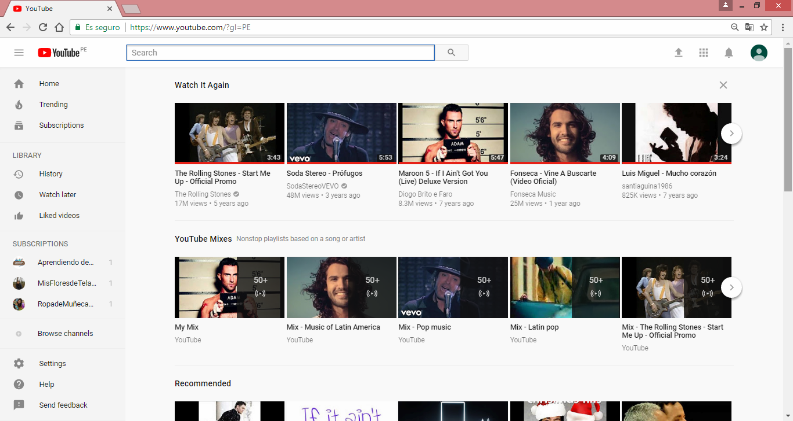

# YouTube - Reto 1

Este proyecto consiste en explicar las partes que desarrollan el UX y el UI en la pagina de YouTube y se realizara de la siguiente manera:

* **UX:**  _Experiencia de Usuario_
* **UI:**  _Interfaz de Usuario_

## Objetivo
El reto consiste en explicar que elementos de la pagina de Youtube son creados por el UX y UI.

**UX**
* Poder buscar un video con el nombre o palabras relacionas al video.
* Subscripciones a diferentes canales.
* La opción send feedback.
* La opción liked videos , donde el usuario puede ver todos los videos que le dio like.
* La opción watch later.
* La opción recomendaciones , que le permite al usuario elegir un video de las multiples opciones que te brindan de acuerdo a temas relacionados con videos ya vistos.
* La opción send feedback.
* La opción de login y mi Canal.
* Al ingresar con una cuenta hay una opción de idioma.
* La opción que te permite ponerle un tema oscuro y con eso oscurecer las zonas claras.
* La opción Browse channels que te permite buscar nuevos canales que tienen temas similares a los que ya estas suscrito.
* Tener diferentes opciones para el tamaño del video (vista normal, modo teatro, modo pantalla completa).
* Poder escoger la calidad del video y que se adapte automaticamente cuando la velocidad del internet es baja.
* La opción de subtitulos en ciertos videos
* Tener la opción de notificaciones para saber en tiempo real que uno o varios de nuestros canales suscritos suben algun video nuevo.
* La opción de poner los videos en reproducción automática, aleatoria o normal si lo deseamos.
* La opción de poder crear listas de reproduccion con nuestros videos favoritos.
* La opción de darle Like o Dislike a un video de acuerdo a nuestro criterio.
* Poder subir un video de manera fácil.
* Poder compartir nuestros videos en las redes sociales , email e incluso podemos incorporar el video en una pagina web atraves de un iframe (Nos muestra el codigo a incrustar).
* Mostrar una vista previa del video cuando señalamos con el puntero del mouse.
* Las opciones de volumen , pausa , siguiente video , velocidad del video.
* La Resolución y proporciones recomendadas
* El reproductor de YouTube agrega barras negras de forma automática a los videos para que se muestren correctamente sin cortarse ni estirarse, independientemente del tamaño del video o del reproductor.
* Creator Studio permite editar las miniaturas de tu canal.
* Realizar un comentario

**UI**

* Los colores caracteristicos de la marca (Rojo, blanco y negro).
* El diseño de los iconos en color gris
* La fuente usada en la pagina web o  en cualquier dispositivo.
* El tamaño de la barra para buscar tanto en la pagina principal como en el video ya seleccionado.
* La posicion de los videos y del video seleccionado.
* El tamaño de los videos y sus miniaturas
* El color que se produce al habilitar la reproducción automática.
* El cambio de color del icono de notificaciones cuando hay uno nuevo.
* Poner una barra roja en los videos ya vistos
* El color del icono de Like o Dislike de acuerdo a la opción elegida.
